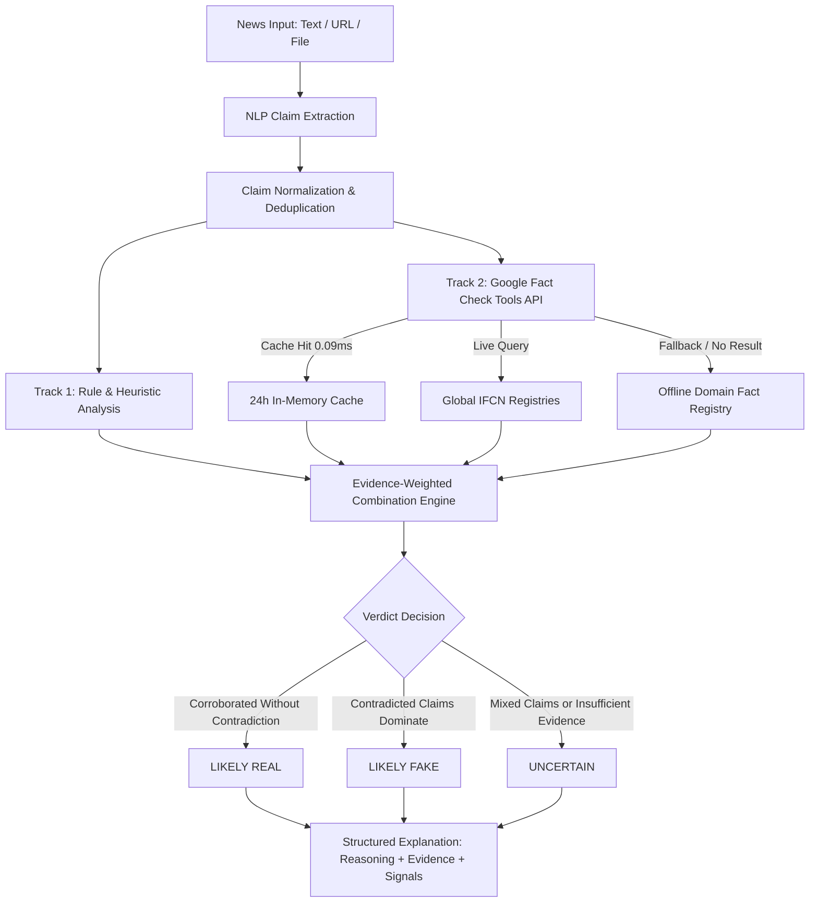

# TruthLens AI — Credibility & Fact Check Engine

TruthLens AI is an evidence-first misinformation detection and credibility analysis platform. It analyzes news articles across multiple modalities (raw text, web URLs, document uploads), extracts individual factual claims, cross-references them against live global fact-checking registries and domain knowledge, and produces transparent, evidence-weighted credibility verdicts.

---

## 🏛️ Finalized Architecture

```text
                 NEWS (Text / URL / File)
                           │
                           ▼
                 NLP / CLAIM EXTRACTION
              (Filtering & Deduplication)
                           │
                  ┌────────┴────────┐
                  ▼                 ▼
           RULE / HEURISTIC     LIVE FACT-CHECK API
              ANALYSIS           (Google Fact Check Tools)
          • Linguistic Tone       • Live Publisher Ratings
          • Sensationalism        • 24-Hour Cache
          • Domain Registry       • IFCN Global Feeds
          • Agency Indicators     • Fallback Resilience
                  │                 │
                  └────────┬────────┘
                           ▼
                    EVIDENCE + RULE
                     VERIFICATION
                           │
                  ┌────────┼────────┐
                  ▼        ▼        ▼
                REAL      FAKE   UNCERTAIN
                  │        │        │
                  └────────┼────────┘
                           ▼
                 STRUCTURED EXPLANATION
          ┌───────────────────────────────────┐
          │ 1. Final Reasoning & Synthesis    │
          │ 2. Fact-Check Evidence Breakdown  │
          │ 3. Linguistic & Rule Signals      │
          └───────────────────────────────────┘
```

### Flow Diagram (Mermaid)



---

## 🔍 Two Verification Mechanisms

TruthLens AI integrates two complementary verification mechanisms:

### Mechanism 1: Rule & NLP Heuristic Analysis
- **Linguistic Signals**: Quantifies sensationalism, emotional language, excessive capitalizations, and exclamations.
- **Offline Domain Registry**: Pre-compiled scientific and empirical facts covering Astronomy, Physics, Medicine, Biology, Law, and Telecommunications.
- **Accredited Primary Source Attribution**: Identifies official statements from established primary institutions (NASA, WHO, CDC, Reuters, AP, NOAA).

### Mechanism 2: Google Fact Check Tools API
- **Live Global Verification**: Connects to the official Google Fact Check Tools Claim Search endpoint (`claims:search`).
- **Rich Evidence Mapping**: Extracts claimant, publisher, review date, textual rating, and original review URL.
- **24-Hour Thread-Safe Cache**: Stores query results in memory with 24-hour TTL, serving repeated identical queries in sub-millisecond time (`0.097ms`).
- **Resilient Fallback**: Handles HTTP errors (400, 403, 429, 500), timeouts, and offline status gracefully without crashing, falling back to local domain heuristics.

---

## ⚖️ Evidence-Weighted Combination Logic

1. **Clearly True Article (`REAL`)**:
   - Primary factual claims are corroborated by live fact-checking reviews or accredited primary sources.
   - Zero contradictions present. High calibrated confidence (75%–96%).
2. **Clearly False Claim (`FAKE`)**:
   - One or more factual claims are explicitly contradicted by live fact-checkers (`False`, `Misleading`, `Pants on Fire`, `Debunked`) or empirical scientific laws.
   - High calibrated confidence (75%–96%).
3. **Mixed / Misleading Content (`UNCERTAIN`)**:
   - Article combines authentic facts with inaccurate or refuted claims.
   - Classified as `MIXED / MISLEADING` with moderate calibrated confidence (55%–75%).
4. **Unverified Content (`UNCERTAIN`)**:
   - Claims lack external fact-checking records and primary citations, but do not contain explicit contradictions.
   - Classified as `UNCERTAIN` with clear guidance that independent primary corroboration is required (never falsely assumed real).

---

## 🛡️ Security & Hardening (Phase 1)

- **Strict Environment Secrets**: `SECRET_KEY` and `GOOGLE_FACTCHECK_API_KEY` are strictly managed via environment variables and `.env`.
- **Production Fail-Safe**: Backend refuses to start in `ENVIRONMENT=production` if `SECRET_KEY` is missing, empty, or insecure.
- **Rate Limiting**: Enforced via `slowapi` on all sensitive endpoints:
  - `POST /api/auth/login`: 5 requests / minute (HTTP 429 on excess)
  - `POST /api/auth/signup`: 5 requests / minute (HTTP 429 on excess)
  - `POST /api/analyze`: 20 requests / minute (HTTP 429 on excess)
  - `POST /api/analyze/upload`: 10 requests / minute (HTTP 429 on excess)
- **Zero Key Leakage**: API keys are never printed, logged, returned in API JSON responses, or sent to client-side bundles.
- **Git Protection**: Comprehensive `.gitignore` ignores all `.env` and `.env.*` files while preserving `.env.example`.

---

## 🚀 Running the Project

### 1. Environment Setup
Copy `.env.example` to `backend/.env`:
```powershell
cp .env.example backend/.env
```
Ensure `SECRET_KEY` and `GOOGLE_FACTCHECK_API_KEY` are populated in `backend/.env`.

### 2. Start the Backend API (Port 8000)
```powershell
cd backend
python run.py
```
*API documentation is available at `http://localhost:8000/docs`.*

### 3. Start the Frontend (Port 8443)
```powershell
npm run dev -- --host 0.0.0.0 --port 8443
```
*Web application is available at `http://localhost:8443`.*

---

## 🧪 Automated Test Suites

TruthLens AI includes three automated test suites:

### 1. Security & Rate Limiting Test Suite
```powershell
cd backend
python test_security_hardening.py
```
*Verifies production fail-safe, SlowAPI rate limiting, and HTTP 429 responses across all 4 endpoints.*

### 2. Live Fact-Checking & Caching Test Suite
```powershell
cd backend
python test_factcheck_live.py
```
*Verifies Google API response mapping, error handling, timeouts, 24h cache TTL, negative caching, and claim deduplication.*

### 3. End-to-End Multi-Modal Test Suite
```powershell
cd backend
python test_e2e_scenarios.py
```
*Verifies all 6 modalities: True articles, False claims, Mixed content, Unverified claims, URL input, and Text input.*

---

## ⚠️ Limitations & System Freeze Notice

- **System Freeze**: As per Phase 2A requirements, core functionality is frozen:
  - **No ML model integration** at this stage.
  - **No OCR** or document image scanning.
  - **No Deepfake / Image forensics** (deferred to Phase 2B).
  - **No Browser extensions** or social sharing packages (deferred to Phase 3).
  - **Database remains SQLite** (`truthlens.db`).
- **Fact-Check Coverage**: Google Fact Check Tools indexes registered IFCN fact-checking organizations. Very recent breaking events (unfolding in the past few hours) may not yet have an accredited fact-check entry; TruthLens AI appropriately flags unverified assertions as `Needs Verification`.
